# awsbaudit 🧊📝🌥️
awsbaudit : AWS Environment Audit # IAM # Policy Simulator # Security Groups # CloudTrail # CloudWatch # EC2 # VPC 

## Objective
- Review user permissions in AWS IAM.
- Capture audit evidence using AWS IAM Policy Simulator.
- Review Inbound & Outbound networking rules for Amazon EC2 Security Groups.
- Review Amazon VPC configurations, subnets & Network ACLs.
- Review Amazon CloudWatch performance metrics.
- Review raw Amazon CloudTrail logs within Amazon S3.

## Basic AWS Environment Audit

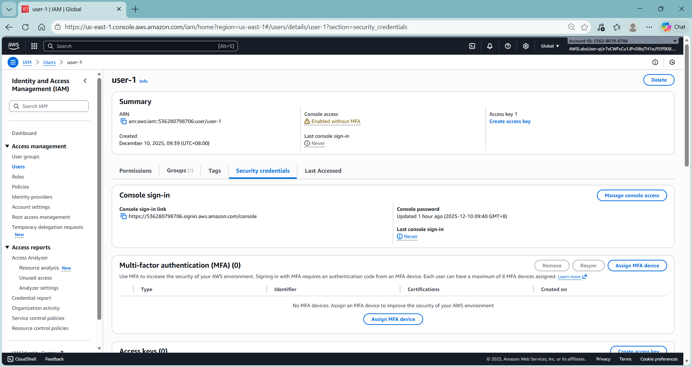

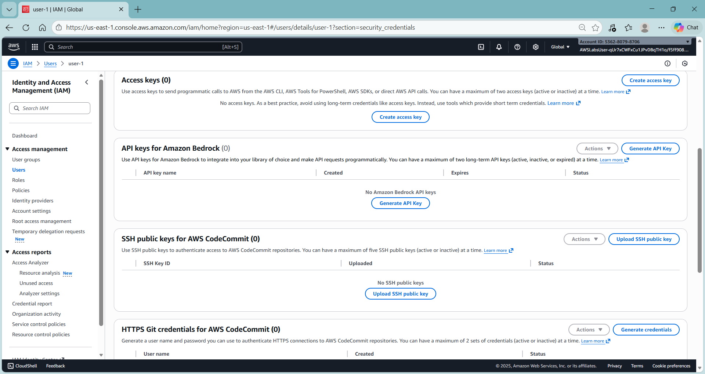

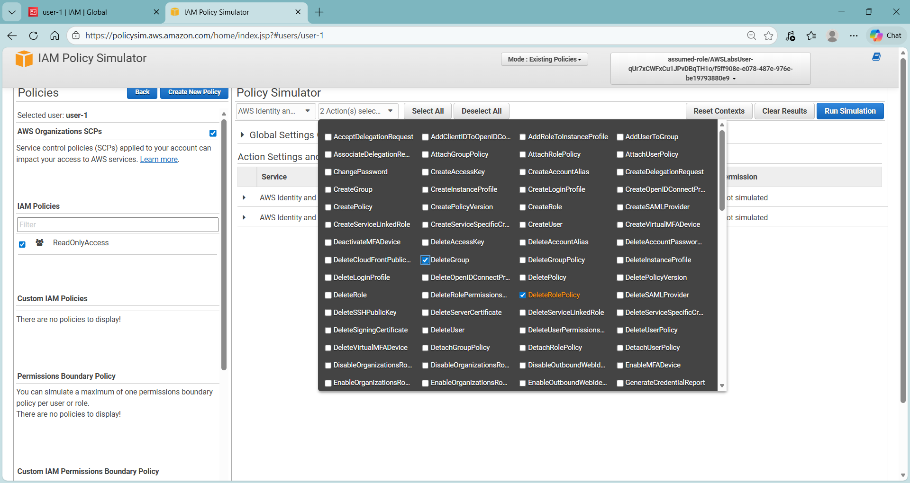

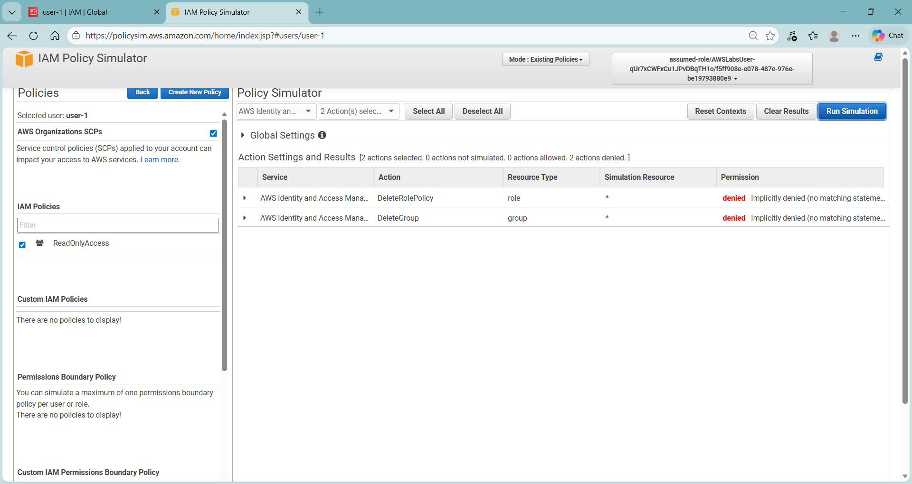

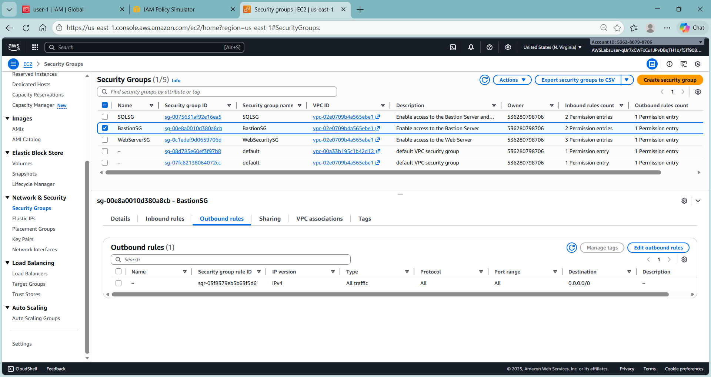

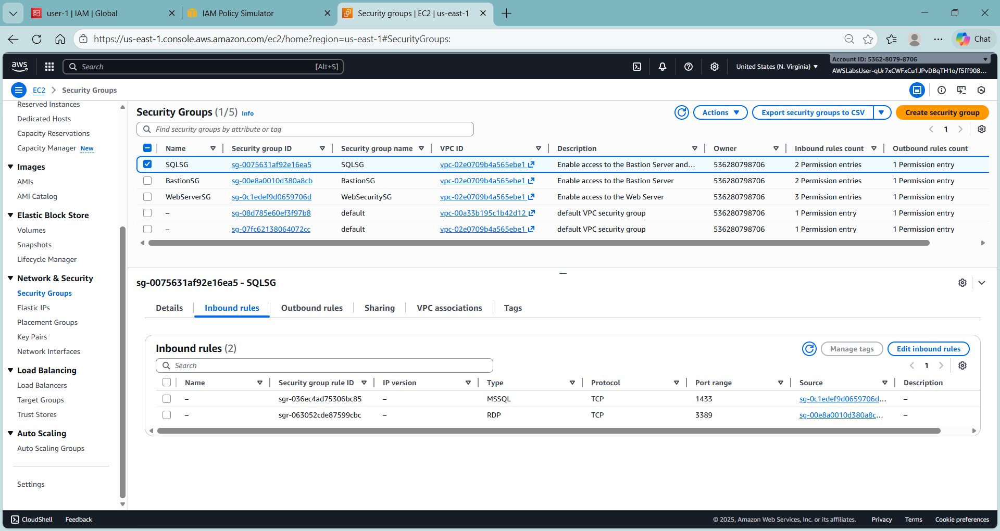

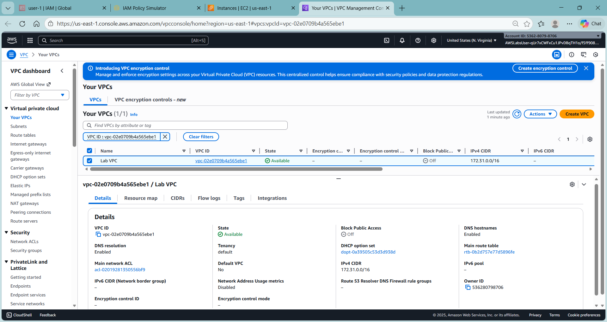

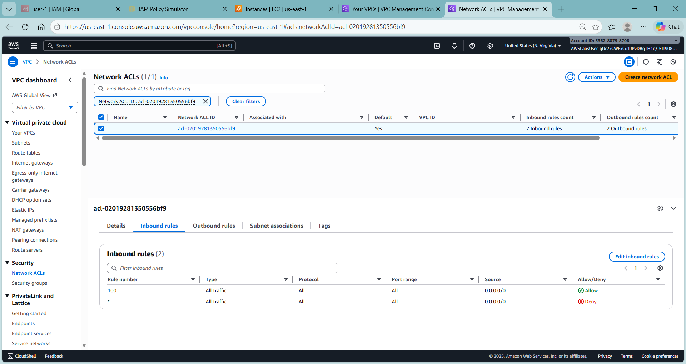

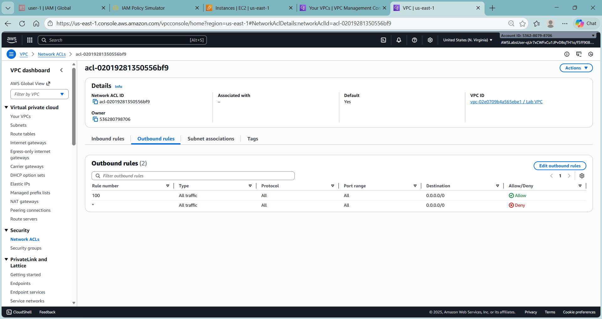

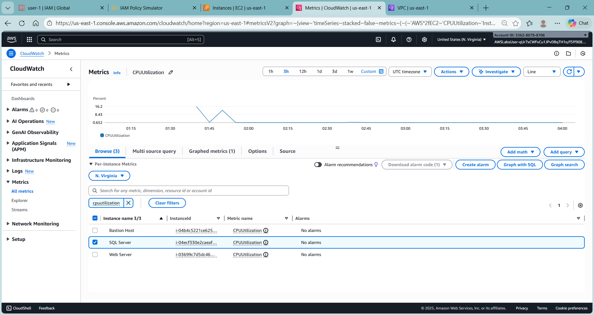

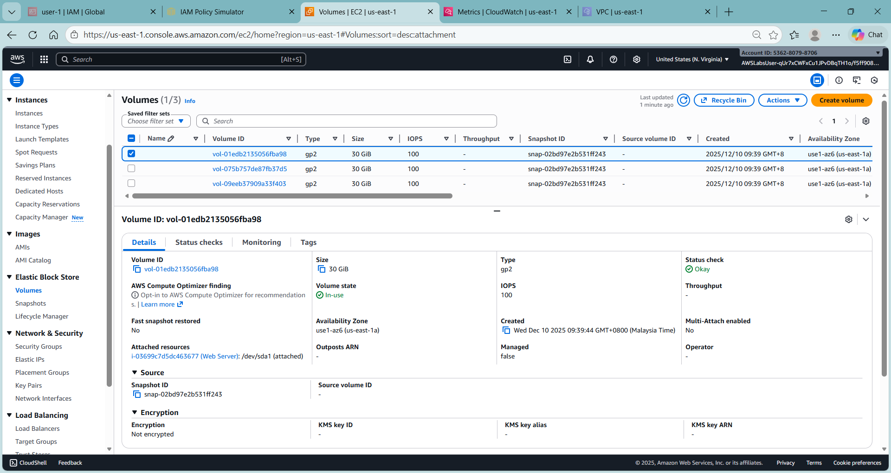

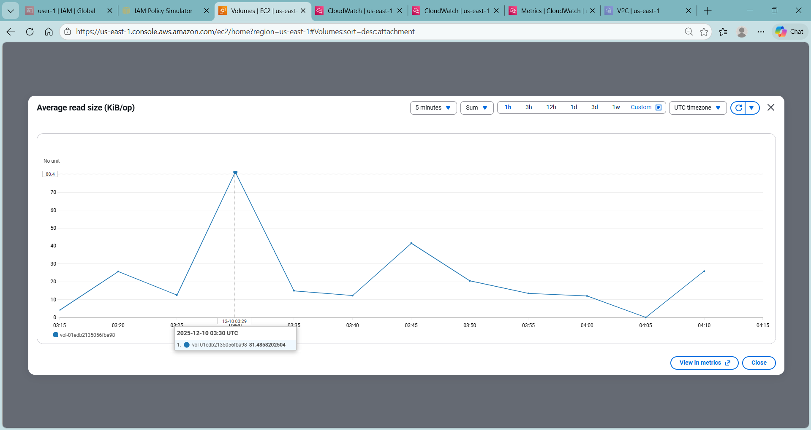

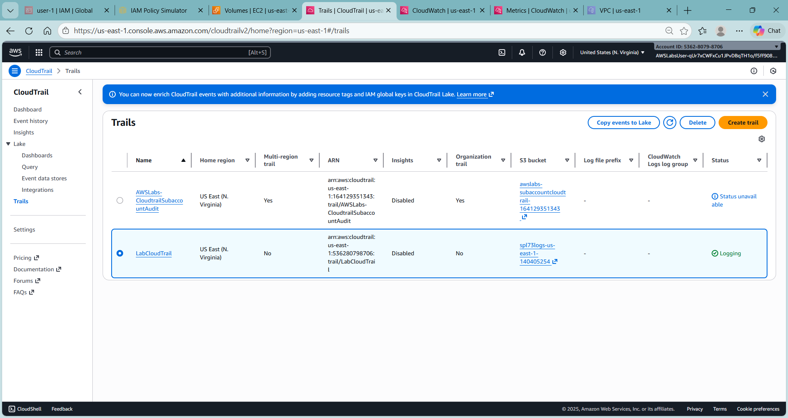

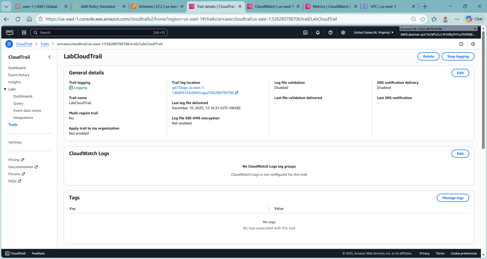

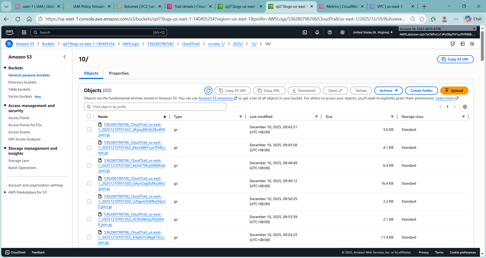

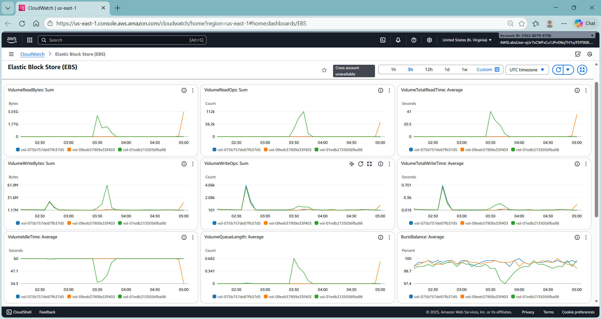

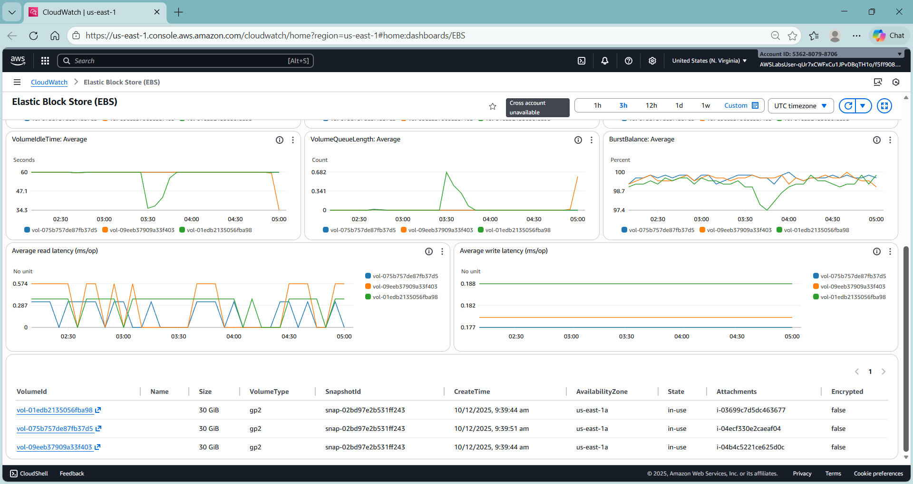

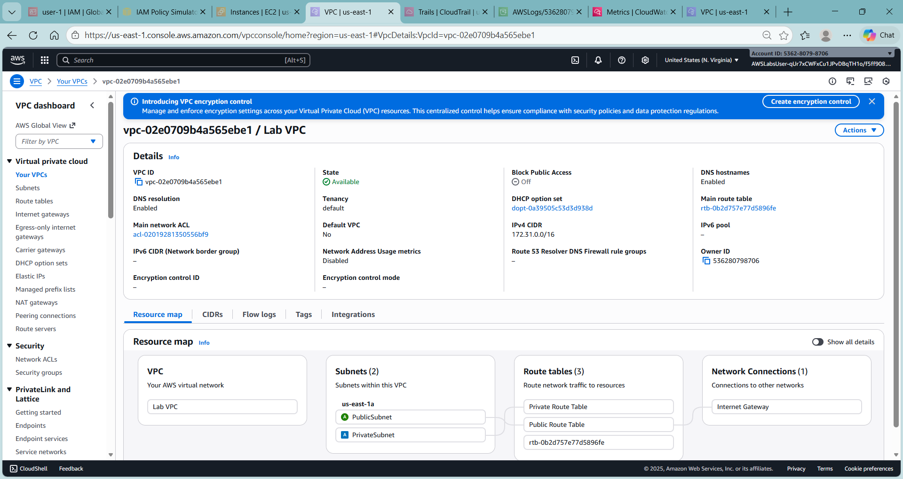

